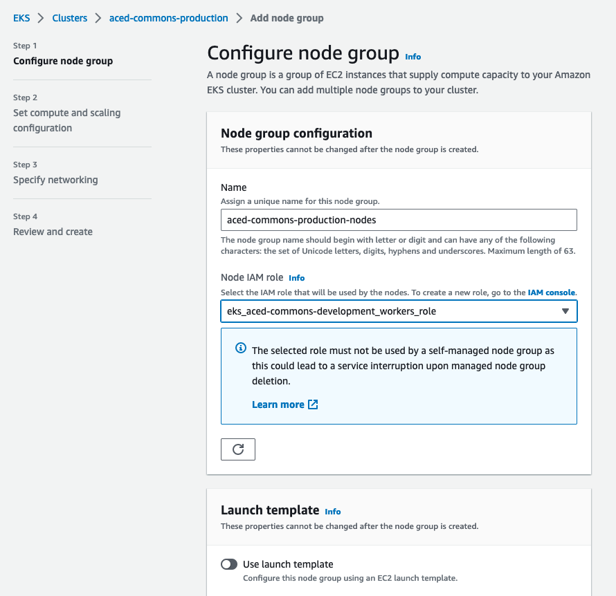

# Instructions for ACED Gen3 Deployment

## Install Rancher

Install Rancher Desktop from [Github Releases page](https://github.com/rancher-sandbox/rancher-desktop/releases/latest)

See docs/gen3_developer_environments.md regarding setting vm.max_map_count.

Note: after restarting rancher desktop, you will need to ensure this value is still set.

```
echo 'sudo sysctl -p' | rdctl shell
```

## Install Kubernetes

```sh
brew install kubectl
```

## Install Helm

```sh
brew install helm
helm repo add gen3 https://helm.gen3.org
helm repo update
```

## Aced specific files:

* gitops.json - Controls windmill UI configuration - see values.yaml
  Gitops values are encoded as a json string under portal.gitops.json
  ```
  portal:
  ...  
  # -- (map) GitOps configuration for portal
    gitops:
      # -- (string) multiline string - gitops.json
      json: |

  ```

* fence-config.yaml - Authentication config. Same as legacy compose services file except addition of header
    ```
    fence:
    FENCE_CONFIG:
        APP_NAME:
        ...
    ```
* user.yaml - Authorization config. Same as legacy compose services file except addition of header, note contents are a yaml string
    ```
    fence:
    USER_YAML: |
        ...
    ```

* certs
    *See [OneDrive](https://ohsuitg-my.sharepoint.com/:f:/r/personal/walsbr_ohsu_edu/Documents/compbio-tls?csf=1&web=1&e=7oFdxd)*

    Copy the keys into the `gen3-certs.yaml` file.

    ```
    cp Secrets/TLS/gen3-certs-example.yaml Secrets/TLS/gen3-certs.yaml
    cat service.* >> Secrets/TLS/gen3-certs.yaml
    # Then match the key-key value formats in the file
    ```

## Deploy

```sh
# Clone gen3-helm 
git clone https://github.com/ACED-IDP/gen3-helm
git checkout feature/etl

# uninstall previous version
helm uninstall local
# update dependencies
helm dependency update helm/gen3

# Start deployment 
helm upgrade --install local ./helm/gen3 -f values.yaml -f user.yaml -f fence-config.yaml -f Secrets/TLS/gen3-certs.yaml

```

## Increase Elasticsearch Memory

As referenced in the [Gen3 developer docs](gen3_developer_environments.md#elasticsearch-error), Elasticsearch may output an error regarding too low of `max virtual memory` --

```
ERROR: [1] bootstrap checks failed
[1]: max virtual memory areas vm.max_map_count [65530] is too low, increase to at least [262144]
```

To fix this we'll open a shell into the Rancher Desktop node and update the required memory fields -- 

```sh
rdctl shell

sudo sysctl -w vm.max_map_count=262144
sudo sh -c 'echo "vm.max_map_count=262144" >> /etc/sysctl.conf'

sysctl vm.max_map_count
# vm.max_map_count = 262144
```

## Add ETL Pod

> Login to browser first, download credentials.json to Secrets/credentials.json

```sh
kubectl delete configmap gen3-credentials
kubectl create configmap gen3-credentials --from-file Secrets
kubectl delete pod etl
kubectl apply -f etl.yaml
sleep 10
# kubectl describe pod etl
kubectl exec --stdin --tty etl -- /bin/bash
```

## Bucket setup

> Unlike our compose services environment, where docker-compose was responsible for Gen3 and S3 (minio) configurations,  our k8s environment only has responsibility for Gen3 services and dependencies.   S3, whether AWS or Minio based is handled externally.

### Current staging setup

* OHSU - minio setup documented [here](https://ohsuitg-my.sharepoint.com/:t:/r/personal/walsbr_ohsu_edu/Documents/aced-1-minio.md?csf=1&web=1&e=iL5PmW)

* ucl, manchester, stanford

  * create buckets
  

  * grant permissions to a AWS IAM user representing fence.
  

  * see fence-config.yaml:
     * `AWS_CREDENTIALS: {}`  aws_access_key_id, aws_secret_access_key
     * `S3_BUCKETS: {}`  bucket_name, cred, region

## Helpful Command

### Listing Secrets

```sh
kubectl get pods -o json | jq '.items[].spec.containers[].env[]?.valueFrom.secretKeyRef.name' | grep -v null | sort | uniq
```

### Counting pods neither Running or Completed

```sh
kubectl get pods --all-namespaces | grep -v Running | grep -v Completed  | grep -v NAMES | wc -l
```

### Manually change SSL certificate

The SSL certificate and key file are automatically handled by the `Secrets/TLS/gen3-certs.yaml` and invoked in the `helm upgrade` command. However if you wish change the certificate or key for any reason simply delete the `gen3-certs` secret and recreate it with the `crt` and `key` file you wish to use:

```sh
kubectl delete secrets gen3-certs
kubectl create secret tls gen3-certs --cert=Secrets/TLS/service.crt --key=Secrets/TLS/service.key
```
### TODO - Create env varaiables instead of files in etl.yaml 

```sh

export PGDB=`cat /creds/sheepdog-creds/database`
export PGPASSWORD=`cat /creds/sheepdog-creds/password`
export PGUSER=`cat /creds/sheepdog-creds/username`
export PGHOST=`cat /creds/sheepdog-creds/host`
export DBREADY=`cat /creds/sheepdog-creds/dbcreated`
export PGPORT=`cat /creds/sheepdog-creds/port`

echo e.g. Connecting $PGUSER:$PGPASSWORD@$PGHOST:$PGPORT//$PGDB if $DBREADY  
```

### Switch to AWS Kubernetes Context

```sh
export AWS_DEFAULT_PROFILE=staging

aws eks update-kubeconfig --region us-west-2 --name aced-commons
# Updated context arn:aws:eks:us-west-2:119548034047:cluster/aced-commons in /Users/beckmanl/.kube/config

kubectl config get-contexts
# CURRENT   NAME                                                      CLUSTER                                                   AUTHINFO                                                  NAMESPACE
# *         arn:aws:eks:us-west-2:119548034047:cluster/aced-commons   arn:aws:eks:us-west-2:119548034047:cluster/aced-commons   arn:aws:eks:us-west-2:119548034047:cluster/aced-commons
#           rancher-desktop                                           rancher-desktop                                           rancher-desktop
```

### Switch to Local (Rancher Desktop) k8s Context
```sh
# To switch to the local k8s context
kubectl config use-context rancher-desktop
# Switched to context "rancher-desktop".
```

## No network connection between pods or from pods to the outside network

Commands like curl revproxy-service failing or commands like apt update and ping 8.8.8.8 hanging.

Restart the CoreDNS service within the kube-system namespace 

```sh
kubectl rollout restart -n kube-system deployment/coredns
```

# AWS Setup with Cloud Automation/Terraform

- https://github.com/ACED-IDP/cloud-automation
- https://github.com/uc-cdis/cloud-automation
- https://github.com/uc-cdis/cloud-automation/blob/master/doc/csoc-free-commons-steps.md

```sh
ssh ubuntu@ubuntu

tmux new -s dev
```

## Install Gen3 Resources on AWS

```sh
gen3 workon staging aced-commons-production
gen3 cd

mv config.tfvars config.tfvars.bak
cp ../aced-commons-staging/config.tfvars .

vim config.tfvars

diff ../aced-commons-staging/config.tfvars config.tfvars
```

```diff
8c8
< vpc_name = "aced-commons-staging"
---
> vpc_name = "aced-commons-production"
11c11
< vpc_cidr_block = "172.32.0.0/16"
---
> vpc_cidr_block = "172.33.0.0/16"
93c93
< hostname = "staging.aced-idp.org"
---
> hostname = "aced-idp.org"
```

```sh
gen3 tfplan # ~1 minute

gen3 tfapply # ~10 minutes

cp -r aced-commons-production_output/ ~/backups/

Apply complete! Resources: 5 added, 0 changed, 0 destroyed.

# Outputs:
# aws_region = us-west-2
# data-bucket_name = aced-commons-production-data-bucket
# fence-bot_user_id = FOO
# fence-bot_user_secret = FOO
```

## Install Kubernetes Cluster on AWS

```sh
gen3 workon staging aced-commons-production_eks

gen3 cd

mv config.tfvars config.tfvars.bak

cp ../aced-commons-staging_eks/config.tfvars .

vim config.tfvars

diff config.tfvars ../aced-commons-staging_eks/config.tfvars
```

```diff
5c5
< vpc_name      = "aced-commons-production"
---
> vpc_name      = "aced-commons-staging"
7,8c7,8
< ec2_keyname   ="aced-commons-production_automation_dev"
< users_policy  = "aced-commons-production"
---
> ec2_keyname   ="aced-commons-staging_automation_dev"
> users_policy  = "aced-commons-staging"
```

```sh
gen3 tfplan # ~1 minute

gen3 tfapply # ~10 minutes
```

## EKS Node Group

https://us-west-2.console.aws.amazon.com/eks/home?region=us-west-2#/clusters/aced-commons-production

Compute > Add node group



### Node group configuration

Name
`aced-commons-production-nodes`

Node IAM role
`eks_aced-commons-production_workers_role`

### Node group compute configuration

AMI type
`Amazon Linux 2 (AL2_x86_64)`

Capacity type
`On-Demand`

Instance types
`t3.xlarge`

Disk size
`20 GB`

### Node group scaling configuration

Desired size
`2`

Minimum size
`2`

Maximum size
`4`

### Node group update configuration

Maximum unavailable
`1`

### Node group network configuration

Subnets
`eks_public_0`
`eks_public_1`
`eks_public_2`

Configure remote access to nodes
`Enable`

EC2 Key Pair
`aced-commons-production_automation_dev`

Allow remote access from
`All`

## ETL Node Group

- TODO: kubectl coredon command for automatically created nodes?

## RDS (Aurora)

https://us-west-2.console.aws.amazon.com/rds/home?region=us-west-2#


### Engine options

Aurora (PostgreSQL-Compatible)

`Show versions that support Serverless v2`

Aurora PostgreSQL (Compatible with PostgreSQL 14.6)

### Templates
Production

### Settings

DB cluster identifier
aced-commons-development-aurora

Manage master credentials in AWS Secrets Manager

### Instance configuration

DB instance class
`Serverless v2`

Minimum ACUs
`0.5 (1 GiB)`

Maximum ACUs
`10 (20 GiB)`

### Availability & durability

Create an Aurora Replica or Reader node in a different AZ (recommended for scaled availability)
Creates an Aurora Replica for fast failover and high availability.

### Connectivity

Don’t connect to an EC2 compute resource

Virtual private cloud (VPC)
`aced-commons-development`

Public Access
`No`

VPC security group (firewall)
`Choose Existing`

Existing VPC security groups
`Local`, `Default`

### Database authentication

IAM database authentication

### Additional Configuration

Backup retention period
`14 days`

Target Backtrack window
`48 hours`

Log exports
Select the log types to publish to Amazon CloudWatch Logs
`PostgreSQL log`

Log exports
- `Audit log`
- `Error log`
- `General log`
- `Slow query log`

Deletion protection
`Enable`

---

Add to `values.yaml`:

```yaml
global:
  # RDS configuration
  postgres:
    master:
      # Writer instance endpoint
      host: "foo-aurora.rds.amazonaws.com"
      username: <POSTGRES USERNAME>
      password: <POSTGRES PASSWORD>
      port: 5432
```

## ElasticSearch (OpenSearch)

```json
{
    "DomainName": "aced-commons-development-es",
    "AdvancedSecurityOptions": {
        "MasterUserOptions": {
            "MasterUserName": "<MASTER USERNAME>",
            // echo "$(openssl rand -base64 12)_Ek1$" >> es_domain.json
            "MasterUserPassword": "<MASTER USER PASSWORD>"
        }
    },
    "VPCOptions": {
      // int_services
      "SubnetIds": ["subnet-foo"],
      // aced-commons-development-local-sec-group
      "SecurityGroupIds": ["sg-foo"] 
    }
}
```

```sh
aws opensearch create-domain --cli-input-json file://es_domain.json
```

---

Add to `values.yaml`:

```yaml
# OpenSearch configuration
aws-es-proxy:
  enabled: true
  # Endpoint
  esEndpoint: vpc-foo.es.amazonaws.com
  secrets:
    awsAccessKeyId: "<ACCESS KEY ID>"
    awsSecretAccessKey: "<SECRET ACCESS KEY>"
```

## S3 Buckets
- TODO: Steps for S3 Bucket creation

- Cloud Automation automatically creates four buckets:
  - aced-commons-staging-data-bucket	
  - aced-commons-staging-data-bucket-logs	
  - kube-aced-commons-staging-gen3	
  - logs-aced-commons-staging-gen3

- Need to manually create five buckets:
  - aced-production-data-bucket
  - aced-production-manchester-data-bucket
  - aced-production-ohsu-data-bucket
  - aced-production-stanford-data-bucket
  - aced-production-ucl-data-bucket

## Certificate
  - TODO: Steps for validation

## Install Load Balancer Controller

https://docs.aws.amazon.com/eks/latest/userguide/aws-load-balancer-controller.html

```sh
curl -O https://raw.githubusercontent.com/kubernetes-sigs/aws-load-balancer-controller/v2.4.7/docs/install/iam_policy.json

aws iam create-policy \
    --policy-name aced-commons-production-AWSLoadBalancerControllerIAMPolicy  \
    --policy-document file://iam_policy.json

eksctl create iamserviceaccount \
  --cluster=aced-commons-production \
  --namespace=kube-system \
  --name=aws-load-balancer-controller \
  --role-name aced-commons-production-AmazonEKSLoadBalancerControllerRole \
  --attach-policy-arn=arn:aws:iam::119548034047:policy/aced-commons-production-AWSLoadBalancerControllerIAMPolicy \
  --approve --override-existing-serviceaccounts

helm repo add eks https://aws.github.io/eks-charts

helm repo update eks

helm install aws-load-balancer-controller eks/aws-load-balancer-controller \
  -n kube-system \
  --set clusterName=aced-commons-production \
  --set serviceAccount.create=false \
  --set serviceAccount.name=aws-load-balancer-controller

kubectl get deployment -n kube-system aws-load-balancer-controller
# NAME                           READY   UP-TO-DATE   AVAILABLE   AGE
# aws-load-balancer-controller   2/2     2            2           84s
```

## Deploy with Helm

```sh
# https://docs.aws.amazon.com/eks/latest/userguide/create-kubeconfig.html
aws eks update-kubeconfig --region us-west-2 --name aced-commons-production

kubectl config get-contexts

helm upgrade --install local ./helm/gen3 -f Secrets/values.yaml -f Secrets/user.yaml -f Secrets/fence-config.yaml

kc get pods

kc get ingress
```
